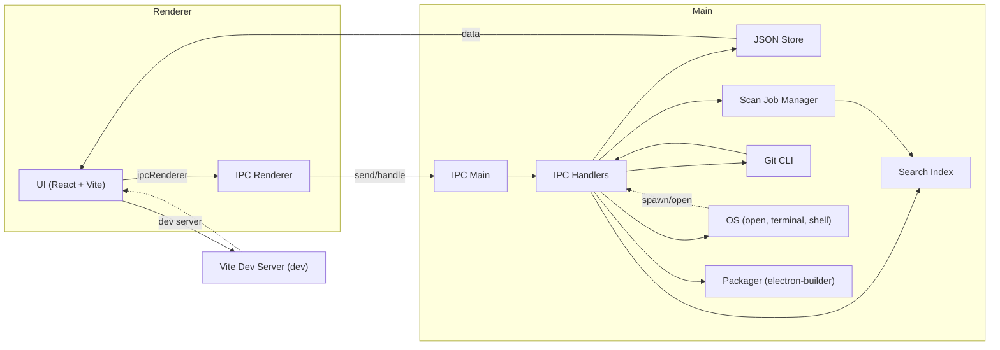

[](LICENSE)
[](https://github.com/m-amitabh/DPE/actions)
[](https://github.com/m-amitabh/DPE/releases)

# Desktop Project Explorer (DPE)

**Desktop Project Explorer (DPE)** is a modern, open source desktop app for managing and exploring software projects on your local machine. Scan directories, visualize project metadata, browse files, and quickly open projects in your IDE or terminal.


## Features

- **Auto-discover** Git and local projects in specified directories
- **Project metadata**: language, stars, last commit, file count
- **Fuzzy search & filters** for fast navigation
- **Quick actions**: open in IDE, terminal, or on GitHub/GitLab
- **README viewing** with syntax highlighting and Mermaid diagram support
- **Smart scanning**: respects ignore patterns
- **Tagging & importance**: organize with custom tags and priorities
- **Dark/Light themes**: system-aware
- **Local-first**: all data stays on your machine, no telemetry


## Tech Stack

- **Electron** (desktop runtime)
- **React + TypeScript + Vite** (frontend)
- **Radix UI + Tailwind CSS** (UI components)
- **Zustand + React Query** (state management)
- **Fuse.js** (fuzzy search)


## Architecture

The app uses a standard Electron split-process architecture:

- **Renderer**: React + Vite UI, markdown rendering (via `react-markdown` + Mermaid)
- **Main**: Handles file-system access, scan jobs, IPC, and storage
- **Store**: Local JSON store for persistence; search index rebuilt from stored projects
- **Packaging**: `electron-builder` creates platform installers





## Gallery

Explore the Desktop Project Explorer in action. Here’s a visual tour of the interface and features:

<div align="center" style="display: flex; flex-wrap: wrap; gap: 12px; justify-content: center;">


</div>


# Desktop Project Explorer (DPE)

A lightweight desktop app to discover, browse, and manage your local software projects.

Quick highlights
- Auto-discover Git and local projects under configured scan paths
- View project metadata, file tree and README (Mermaid diagrams supported)
- Quick actions: open in IDE, open terminal, view on GitHub
- Local-first: your project data stays on your machine

Repository: https://github.com/m-amitabh/DPE

---

## Install

macOS
- Download the `.dmg` from Releases and drag the app to `/Applications`.

Windows
- Run the installer (`.exe`) from Releases.

> Note: prefer the notarized macOS build for the smoothest first-run experience. See Gatekeeper guidance below if you encounter blocking warnings.

---

## macOS Gatekeeper (first-run guidance)

If macOS prevents the app from opening (common for downloads outside the App Store):

1. In Finder, right-click (or Control-click) the app and choose "Open". In the dialog, click "Open" again — this allows the app while keeping Gatekeeper protections.
2. If that doesn't work, open System Settings → Privacy & Security and look for an "Open Anyway" or allow option for the app under the General section.

Advanced (optional): to remove quarantine flags for an app you trust:

```bash
sudo xattr -rd com.apple.quarantine /Applications/"Desktop Project Explorer".app
```

If macOS reports the app is "damaged and can't be opened", prefer a notarized release or use the right-click/Open flow above.

---

## Development (quickstart)

Requirements: Node.js 18+, npm

```bash
npm install
npm run dev         # start renderer dev server
npm run electron:dev # launch Electron against the dev server
```

To build a packaged release:

```bash
npm run package
```

---


## Usage

1. Open **Settings** and add one or more scan paths.
2. Click **Scan** to discover projects.
3. Browse, filter, and open projects. Use the **README** tab to view documentation and diagrams.

Tip: Use the "Include as project" checkbox in Settings to explicitly treat a non-repository folder as a project.

---


## Contributing

Contributions are welcome! Please:
- Fork the repo and create a feature branch
- Open a pull request with a clear description
- Follow the code style and add tests if possible

By participating, you agree to abide by the [Contributor Covenant Code of Conduct](https://www.contributor-covenant.org/version/2/1/code_of_conduct/).


## License

This project is licensed under the [MIT License](LICENSE).

## Community & Support

- [Discussions](https://github.com/m-amitabh/DPE/discussions)
- [Issues](https://github.com/m-amitabh/DPE/issues)

---

Made with ❤️ by [@m-amitabh](https://github.com/m-amitabh) and contributors.
